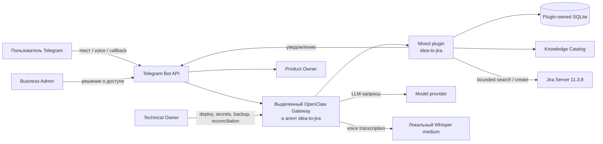
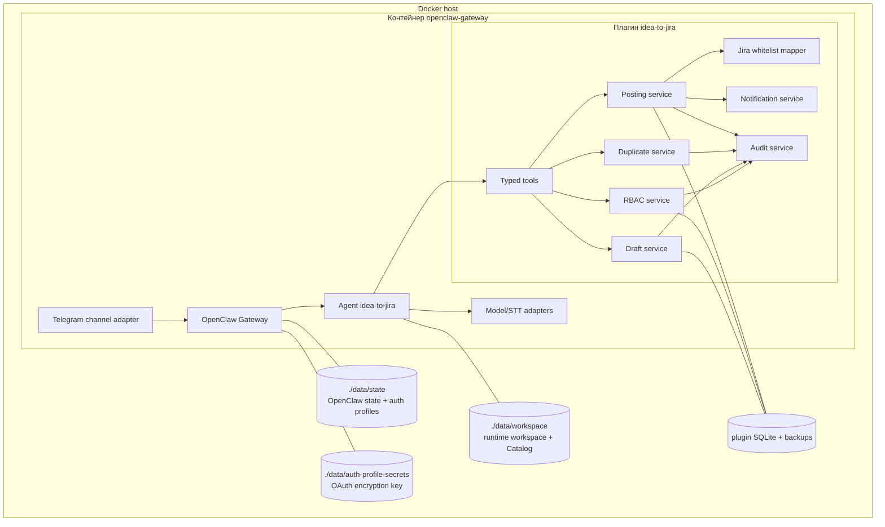
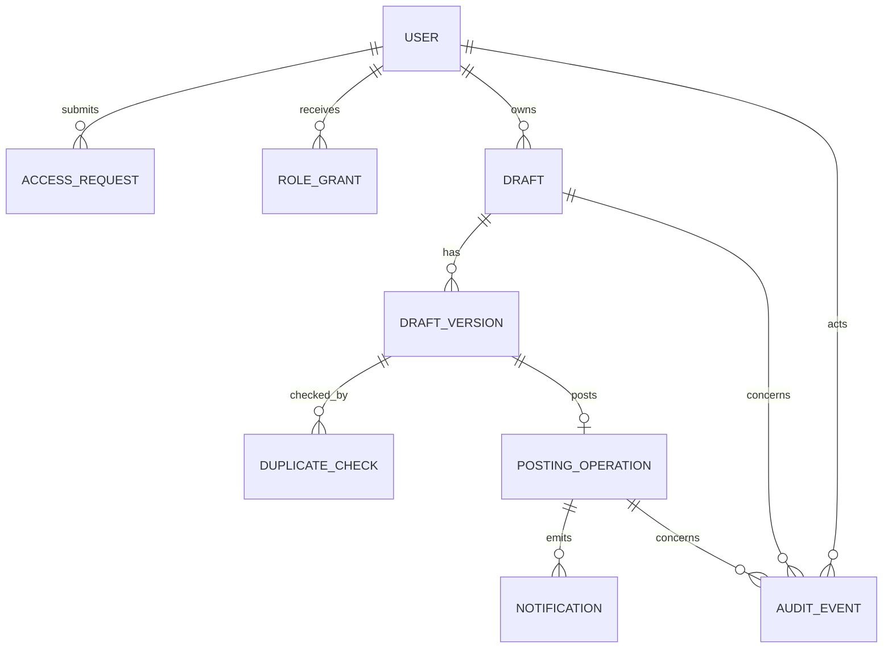
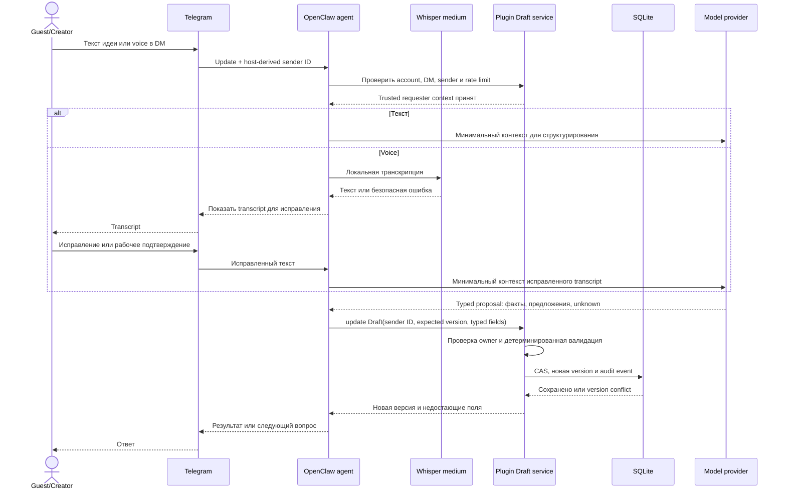
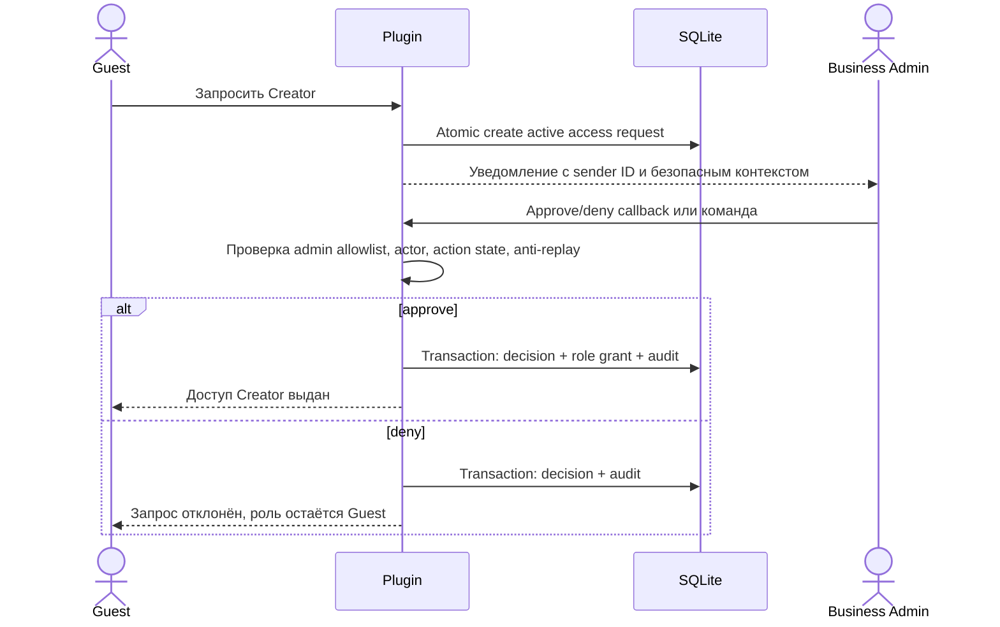
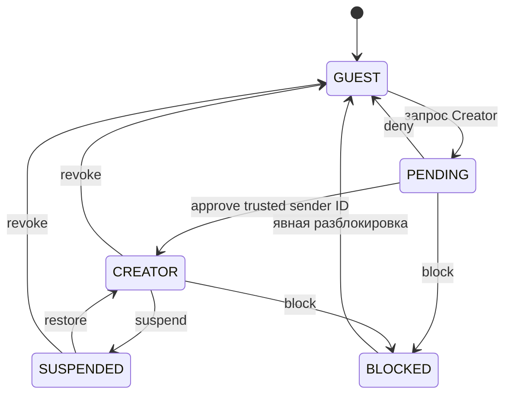
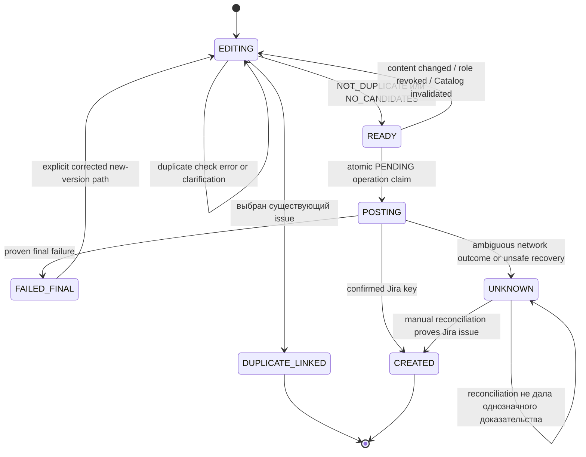
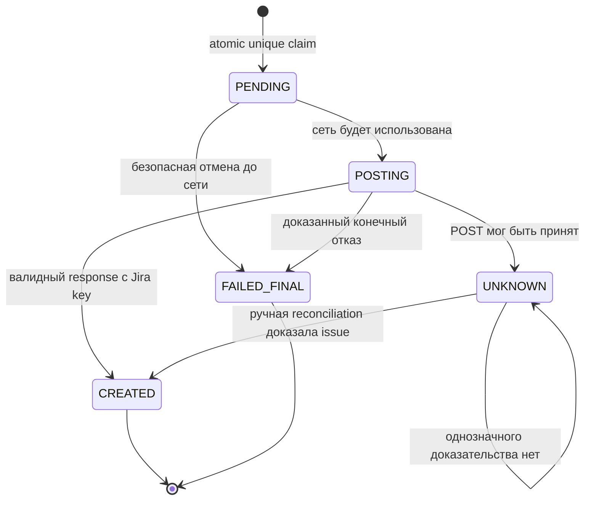
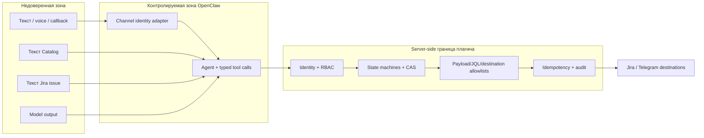
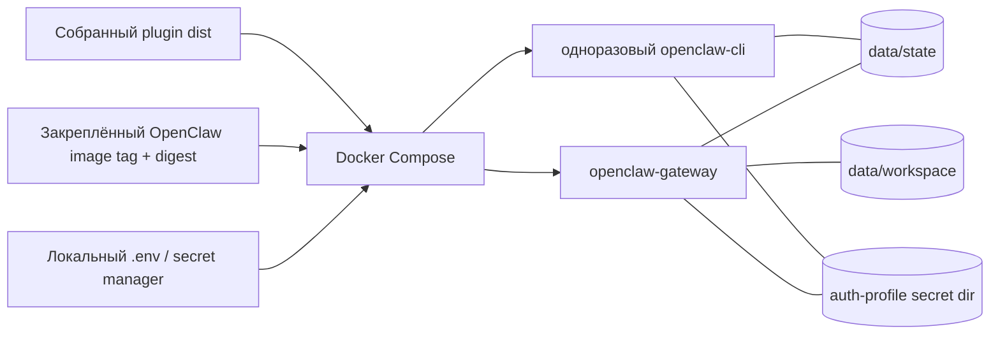

# Архитектура Idea-to-Jira

**Статус:** целевая архитектура MVP и границы текущего scaffold

**Дата:** 2026-08-20

**Целевой контур:** выделенный OpenClaw в Docker, Telegram, Jira Server 11.3.8

## 1. Назначение системы

Idea-to-Jira — выделенный Telegram-ассистент, который помогает сотруднику превратить неструктурированную продуктовую идею в проверенный Draft и, после server-side проверок доступа и дублей, создать Jira `Feature` в фиксированном проекте.

Система строится как один выделенный OpenClaw Gateway с одним агентом и mixed plugin `idea-to-jira`. Отдельный прикладной backend не предполагается: детерминированная бизнес-логика, RBAC, состояние Draft, интеграция с Jira и аудит принадлежат плагину, а OpenClaw ведёт диалог, вызывает только разрешённые typed tools и управляет model/channel runtime.

> Текущий репозиторий — production-oriented scaffold, а не готовый MVP. Реализованы stage-01 runtime/config/security foundation, typed validation Draft и fail-closed Jira adapter; RBAC, SQLite, поиск дублей, Jira POST, reconciliation и уведомления пока описаны как целевой контракт.

## 2. Архитектурные принципы

1. **Один изолированный контур.** Отдельные Telegram bot account, OpenClaw agent, state/workspace volumes, plugin database и secrets.
2. **Модель не является границей безопасности.** Любое право, переход состояния и Jira payload проверяются детерминированным кодом плагина.
3. **Fail closed.** Неизвестная identity, роль, версия Catalog, Jira metadata, обязательное поле или исход POST запрещают дальнейшую автоматизацию.
4. **Минимальные полномочия.** Агенту доступен allowlist typed plugin tools без shell, browser, filesystem, generic HTTP и прямого Jira create.
5. **Серверная идентичность.** Пользователь определяется только Telegram sender ID из доверенного channel adapter; имя и username — недоверенные отображаемые данные.
6. **Whitelist mapping.** Модель не формирует произвольный Jira JSON/JQL/URL; payload строится server-side из разрешённых полей и значений.
7. **Идемпотентность и явная неопределённость.** Неоднозначный сетевой исход Jira POST фиксируется как `UNKNOWN`; повторная отправка до ручной reconciliation запрещена.
8. **Минимизация данных.** Модели, логам, уведомлениям и поиску Jira передаётся только необходимый минимум.

## 3. Текущее и целевое состояние

| Область | Реализовано в scaffold | Целевой MVP |
| --- | --- | --- |
| OpenClaw plugin | Единая startup config validation, `before_agent_run` и tool-context gates, один typed tool | Полный набор узких server-side tools и lifecycle hooks |
| Draft | Нормализация и валидация полей `Feature` в памяти | Версионированный Draft, CAS, диалог, readiness и retention в SQLite |
| Jira | Fail-closed adapter: write всегда запрещён | Bounded duplicate search, whitelist mapper, POST и manual reconciliation |
| Доступ | Channel/account/agent/user-trigger/DM/destination fail-closed gate; RBAC ещё не реализован | Guest/Creator/Business Admin с атомарными grant/revoke |
| Knowledge Catalog | Неполная Markdown-заготовка | Версионированный, проверяемый и fail-closed каталог маршрутизации |
| Voice | Не реализован | Локальный Whisper `medium`, показ и коррекция транскрипта |
| Уведомления | Не реализованы | Идемпотентная доставка автору, Business Admin и Product Owner |
| Наблюдаемость | Раздельные liveness/create-readiness signals и санитаризированные security audit codes | Structured logs, metrics, alerts, audit export и runbooks |

Подтверждённый контракт закреплённой версии OpenClaw `2026.7.1-2`: `before_agent_run` передаёт host-derived `accountId`, `channelId`, `senderId`, а hook context — `agentId`, `trigger` и `chatId`; tool factory получает `agentId`, `messageChannel`, `agentAccountId`, `requesterSenderId` и `deliveryContext`. Параметры tool и текст модели не являются источником identity. Отсутствие любого обязательного поля, non-user trigger, thread/group route или несовпадение DM destination с sender приводит к отказу; эти варианты закреплены unit-тестами.

## 4. Контекст системы



### 4.1. Внешние системы

- **Telegram Bot API** — транспорт сообщений. Содержимое недоверенное; sender ID от адаптера используется как техническая identity.
- **Model provider** — помогает извлекать и формулировать данные Draft. Не принимает решения о правах и не вызывает Jira напрямую.
- **Whisper `medium`** — локальная транскрипция voice. Исходный voice хранится лишь на время обработки и безопасного ограниченного retry.
- **Jira Server 11.3.8** — владелец созданной `Feature` и источник кандидатов на дубли/create metadata.
- **Knowledge Catalog** — версия бизнес-маршрутизации: Product Owner, направление, допустимые значения и служебные привязки.

## 5. Контейнеры и компоненты



### 5.1. OpenClaw Gateway и агент

OpenClaw отвечает за Telegram-сессию, модельный диалог, загрузку плагина, вызов tools и runtime auth profiles. Конфигурация создаёт отдельного агента, peer-scoped DM sessions и explicit allowlist инструментов.

Агент может:

- принять текст/voice и уточнить идею;
- вызвать узкий typed tool;
- показать пользователю состояние и безопасный результат;
- использовать санитаризированный контекст Catalog.

Агент не может:

- назначить себе или пользователю роль;
- доверять role claim из текста или callback;
- менять Jira project/type/field IDs/destination;
- отправить произвольный HTTP/Jira payload;
- считать model output доказательством успешного create.

### 5.2. Mixed plugin `idea-to-jira`

Плагин — серверная граница приложения. Его целевые зоны ответственности:

- trusted identity и RBAC;
- версионированный Draft и атомарные переходы;
- проверка обязательных полей и business rules;
- загрузка/проверка Knowledge Catalog;
- ограниченный поиск Jira-дублей;
- server-side mapping Jira payload;
- идемпотентный create и обработка `UNKNOWN`;
- независимая доставка уведомлений;
- structured audit без секретов и полного пользовательского текста.

### 5.3. SQLite

SQLite принадлежит только плагину и хранит прикладное состояние. Для production обязательны WAL, foreign keys, bounded busy timeout, транзакционные миграции и `synchronous=FULL` для ролей и posting operations.

Предполагаемые логические сущности:



Это логическая схема; конкретные таблицы и миграции должны быть зафиксированы при реализации и покрыты upgrade/restore тестами.

### 5.4. Knowledge Catalog

Catalog отделяет изменяемую бизнес-маршрутизацию от prompt и кода. Версия должна иметь schema version, checksum, дату публикации и проверяемые маршруты. Если Catalog отсутствует, неоднозначен или просрочен, Draft можно сохранить, но create запрещается.

### 5.5. Jira adapter и mapper

Jira adapter допускает только заранее определённые origin, project, issue type и операции. Mapper собирает payload из whitelist, сверяет обязательные options/create metadata и не передаёт model-generated JSON напрямую.

В текущем scaffold `createIssue()` намеренно всегда возвращает ошибку. Это защищает от ошибочного впечатления, что Docker quickstart уже включает Jira write.

## 6. Роли и полномочия

| Роль | Может | Не может |
| --- | --- | --- |
| **Guest** | Вести собственный диалог, сохранять Draft, исправлять транскрипт, запросить доступ | Видеть детали Jira-дублей, подтверждать duplicate decision, создавать Jira issue |
| **Creator** | Всё доступное Guest; видеть разрешённые кандидаты, принять решение о дубле, запустить целевой READY-flow | Менять server-side mapping, проект/type, выдавать роли, повторять `UNKNOWN` POST |
| **Business Admin** | Одобрить/отклонить access request, выдать/отозвать Creator по точному sender ID, видеть санитаризированный аудит решений | Получать host/OpenClaw owner access, читать секреты или полный произвольный пользовательский контент |
| **Product Owner** | Получить уведомление о подтверждённой Jira-задаче и продолжить работу в Jira | Управлять приложением через уведомление, если отдельно не назначена административная роль |
| **Technical Owner** | Deploy/rollback, секреты, backup/restore, мониторинг, ручная reconciliation `UNKNOWN` | Обходить продуктовые правила без отдельного аудируемого operational process |
| **Catalog Owner** | Публиковать проверяемые версии Catalog | Менять runtime policy, secrets или роли через содержимое Catalog |

### 6.1. Матрица основных операций

| Операция | Guest | Creator | Business Admin | Technical Owner |
| --- | :---: | :---: | :---: | :---: |
| Создать/редактировать свой Draft | ✓ | ✓ | Только как обычный пользователь | Диагностика по runbook |
| Запросить Creator | ✓ | — | Просмотр решения | Диагностика |
| Grant/revoke Creator | — | — | ✓ | Только аварийная процедура с аудитом |
| Получить детали дублей | — | ✓ | Только санитаризированный аудит | Диагностика |
| Создать Jira Feature | — | ✓, через автоматизированный flow | — | Не вручную через приложение |
| Reconcile `UNKNOWN` | — | — | Просмотр статуса | ✓ |
| Управлять secrets/backup | — | — | — | ✓ |

Права проверяются внутри каждого server-side handler, а не только в prompt или интерфейсе Telegram.

## 7. Основные сценарии

### 7.1. Текст или voice → Draft



Модель предлагает формулировки, но итоговая структура проходит typed schema, нормализацию и server-side business validation. Model-only предложения не становятся подтверждёнными фактами автоматически. Ошибка Whisper сохраняет существующий Draft, предлагает текстовый ввод и не запускает Jira create.

### 7.2. Запрос и выдача доступа



Grant/revoke атомарны. Отзыв роли блокирует новые Creator-only операции; уже созданная Jira-задача не откатывается.

### 7.3. Проверка дублей, READY и создание Jira Feature

```mermaid
sequenceDiagram
    actor C as Creator
    participant P as Plugin
    participant D as SQLite
    participant K as Knowledge Catalog
    participant J as Jira
    participant T as Telegram
    actor PO as Product Owner

    C->>P: Завершить текущую версию Draft
    P->>D: Проверить owner, активного Creator и Draft version
    P->>K: Получить проверенный route для catalog version
    K-->>P: Допустимый route и Jira option IDs
    P->>J: Bounded duplicate search в фиксированном scope
    J-->>P: Кандидаты или NO_CANDIDATES
    P->>D: Сохранить result, version, catalog и fingerprint
    alt Есть кандидаты
      P-->>C: Минимальные разрешённые сведения
      C->>P: DUPLICATE_SELECTED или NOT_DUPLICATE
      P->>D: Atomic duplicate decision
    else Кандидатов нет
      P->>D: Зафиксировать NO_CANDIDATES
    end

    alt Выбран существующий дубль
      P->>D: Связать Draft с известным Jira key
      P-->>C: Вернуть ссылку; новый create запрещён
    else NOT_DUPLICATE или NO_CANDIDATES
      P->>P: Whitelist mapping и metadata/options validation
      P->>D: В одной транзакции проверить READY и claim operation
      D-->>P: Уникальная POSTING operation
      P->>P: Повторно проверить Creator непосредственно перед сетью
      P->>J: Один POST create issue
      alt Подтверждённый успех
        J-->>P: Jira key + валидный response
        P->>D: CREATED + Jira key + audit
        P-->>C: Feature создана
        P-->>T: Идемпотентное уведомление
        T-->>PO: Jira key + минимальный контекст
      else Доказанная финальная ошибка
        J-->>P: Безопасно классифицируемая ошибка
        P->>D: FAILED_FINAL + error code
        P-->>C: Создание не выполнено
      else Таймаут после возможной отправки
        J--xP: Исход неизвестен
        P->>D: UNKNOWN без Jira key + alert
        P-->>C: Автоповтор запрещён, нужна reconciliation
      end
    end
```

Отдельной кнопки preview/create целевой flow не требует: после готовности Draft и сохранённого решения по дублям плагин автоматически и атомарно claim-ит операцию. Ошибка duplicate search не считается `NO_CANDIDATES`; модель не получает прямой Jira create tool.

### 7.4. `UNKNOWN` и ручная reconciliation

```mermaid
sequenceDiagram
    participant P as Plugin
    participant D as SQLite
    participant J as Jira
    actor TO as Technical Owner

    P->>D: Зафиксировать UNKNOWN без Jira key
    P-->>TO: Alert с operation ID и санитаризированными метаданными
    TO->>D: Получить audit, payload hash и timestamps
    TO->>J: Ручной поиск по утверждённому runbook
    alt Однозначно найдена та же Jira-задача
      J-->>TO: Доказанный issue key
      TO->>D: Связать key и reconciliation decision
      D-->>P: CREATED после ручного доказательства
    else Задача не найдена или доказательство неоднозначно
      TO->>D: Зафиксировать результат проверки
      D-->>P: UNKNOWN остаётся заблокированным
      Note over TO,P: Любое дальнейшее действие требует отдельного аудируемого решения;<br/>автоматический retry и новый auto operation запрещены
    end
```

Локальные `operation_id`, idempotency key и payload hash не являются Jira identity. Без валидного response или однозначной ручной reconciliation Jira key не выдумывается, success не сообщается и ссылка не строится.

## 8. Машины состояний

### 8.1. Роль и доступ



Admin-side переходы проверяют host-derived sender ID администратора, server-side allowlist и текущую version записи в одной транзакции. Approval роли не является approval отдельной Feature.

### 8.2. Жизненный цикл Draft



`EDITING` — каноническое persistent состояние schema v1. Voice transcript review и duplicate-check execution являются отдельными records/substates профильных компонентов, а не альтернативными состояниями Draft. `READY` — вычисляемое и перепроверяемое состояние, а не доверенная команда модели. Любое изменение Draft создаёт новую версию и инвалидирует результаты, привязанные к прежней версии. Завершённая или `UNKNOWN` operation сохраняется и продолжает блокировать повтор своего payload.

### 8.3. Posting operation



| Состояние | Значение | Разрешённый следующий шаг |
| --- | --- | --- |
| `PENDING` | Уникальная операция создана, сеть ещё не использовалась | Начать POST или безопасно отменить до сети |
| `POSTING` | Jira request отправляется/мог быть отправлен | Зафиксировать доказанный результат либо `UNKNOWN` |
| `CREATED` | Получен и проверен Jira key | Только уведомления и аудит |
| `FAILED_FINAL` | Доказано, что текущая операция не создала issue и не подлежит auto retry | Исправить Draft и создать новую version/operation по правилам |
| `UNKNOWN` | Jira могла принять request, но Jira key не доказан | Только ручная reconciliation; автоматический POST запрещён |

Намеренно отсутствует переход `UNKNOWN → POSTING`. До любого потенциального повтора manual reconciliation обязательна, а дальнейшее действие возможно только как отдельное аудируемое решение по runbook. Локальные `operation_id` и `payload_hash` нужны для идемпотентности и трассировки, но не являются идентичностью Jira issue.

## 9. Данные и владение

| Данные | Владелец | Хранение | Примечание |
| --- | --- | --- | --- |
| Telegram session/channel state | OpenClaw | `data/state` | Содержит runtime/auth state; вне Git |
| Draft, версии, access requests | Plugin | SQLite | Доступ по owner sender ID и роли |
| Role grants/revocations | Plugin | SQLite | Решения атомарны и аудируются |
| Business Admin allowlist | Operator config/secret | Runtime config | Не выводится модели или пользователю |
| Knowledge Catalog | Catalog Owner/OpenClaw | Versioned Markdown + runtime index | Версия/checksum участвуют в проверках |
| Duplicate result/decision | Plugin | SQLite | Привязаны к Draft version и сроку актуальности |
| Posting operation | Plugin | SQLite | Unique idempotency key + state machine |
| Jira issue | Jira | Jira Server | Подтверждается только валидным Jira response/reconciliation |
| Audit events | Plugin | Append-only SQLite/export | IDs, hashes, outcomes; без секретов и полных descriptions |
| Model auth profiles | OpenClaw | `data/state` | OAuth/API credentials вне Git и plugin DB |
| OAuth auth-profile encryption key | OpenClaw | `OPENCLAW_AUTH_PROFILE_SECRET_DIR` | Отдельный persistent mount `/home/node/.config/openclaw`; восстанавливается вместе с auth profiles, не входит в Git |

Сроки retention определены в `docs/NON_FUNCTIONAL_REQUIREMENTS.md`: Draft и временные данные — 90 дней после последнего изменения; access/audit/posting — 1 год, если production policy не требует иного.

## 10. Границы доверия и угрозы



Ключевые меры:

- sender ID берётся только из host-derived context;
- callbacks связаны с actor/chat/action state и защищены от replay;
- пользовательский текст не может менять tool allowlist, destinations и поля Jira;
- duplicate search имеет фиксированный JQL builder, timeout, page/candidate/field limits;
- логи и audit редактируются: без токенов, headers, raw updates, voice и полных descriptions;
- secrets находятся в SecretRef/защищённом runtime environment и не передаются модели;
- Jira credential ограничен search/create в нужном scope;
- контейнер запускается с read-only root filesystem, dropped capabilities и `no-new-privileges`.

## 11. Отказы и восстановление

### 11.1. Классификация отказов

| Отказ | Поведение |
| --- | --- |
| LLM недоступен | Draft сохраняется; пользователь получает безопасный статус; create не запускается |
| Whisper недоступен | Предлагается текстовый ввод; необработанный voice не становится Jira content |
| Catalog невалиден | Draft можно редактировать; READY/create блокируются |
| Jira search недоступен | Duplicate decision не считается завершённым; create блокируется |
| Jira POST дал доказанный 4xx | `FAILED_FINAL`, безопасный код ошибки, без автоматического повтора |
| Jira 429/5xx до доказанной отправки | Bounded retry с backoff и `Retry-After`, если категория доказанно безопасна |
| Таймаут после возможной отправки | `UNKNOWN`, alert, только manual reconciliation |
| Telegram notification не доставлено | Jira create не откатывается; отдельный bounded retry по notification key |
| Restart во время `POSTING` | Если отсутствие отправки не доказано, операция восстанавливается как `UNKNOWN` |
| SQLite/migration failure | Create запрещён; диагностический режим и alert без раскрытия секретов |

### 11.2. Backup и rollback

Backup охватывает plugin SQLite, проверяемую версию Catalog и необходимое OpenClaw state согласно production runbook; credentials хранятся отдельно. Deployment требует migration preflight, backup, compatibility checks, smoke test и проверенный restore/rollback. RPO/RTO должны быть согласованы до go-live.

## 12. Deployment



- `openclaw-gateway` — постоянный сервис.
- `openclaw-cli` — одноразовый сервис с теми же state и auth-profile-secret mounts, что и Gateway, для OAuth/config diagnostics.
- Gateway публикуется только на `127.0.0.1`.
- Root filesystem read-only; writable paths ограничены volumes/tmpfs.
- Образ OpenClaw закрепляется release tag и фиксируется digest в release record.
- `.env`, `data/**`, OAuth profiles, auth-profile encryption key, SQLite и backups не входят в Git.
- OAuth backup/restore сохраняет согласованную пару: auth profiles из `data/state` и encryption key из `OPENCLAW_AUTH_PROFILE_SECRET_DIR`; потеря одного элемента делает OAuth state невосстановимым.
- Healthcheck доказывает только доступность Gateway endpoint, но не readiness Telegram/model/Jira/E2E.

Практические команды запуска и авторизации описаны в `README.md`.

## 13. Структура кода и пакетов

```text
idea-to-jira/
├── package.json                    # корневой private npm workspace
├── packages/
│   └── idea-to-jira-plugin/
│       ├── src/
│       │   ├── index.ts            # plugin, typed input hook и context-gated tool
│       │   ├── config.ts           # единый immutable effective config + startup validation
│       │   ├── runtime/            # requester context, policy/rate limit, private state root
│       │   ├── domain/idea.ts      # текущие TypeScript-типы Draft
│       │   ├── workflow/
│       │   │   └── draft-service.ts # нормализация и typed validation
│       │   ├── catalog/catalog.ts  # чтение Markdown без trusted parsing
│       │   └── jira/client.ts      # DisabledJiraIssueClient
│       ├── tests/                  # config, security policy, deployment и Draft tests
│       ├── package.json
│       └── openclaw.plugin.json    # manifest и schema config
├── config/openclaw.json5           # agent/channel/tool/plugin config
├── knowledge/catalog.md            # неполная заготовка Catalog
├── docs/                           # требования, решения, Jira contract
├── scripts/                        # validation/preflight/liveness/create-readiness
├── Dockerfile                      # сборка plugin + OpenClaw image
└── compose.yaml                    # Gateway/CLI, volumes и hardening
```

По мере реализации новые сервисы плагина должны оставаться узкими и тестируемыми: RBAC, Draft repository/state machine, Catalog loader, duplicate search, Jira mapper/client, operation repository, reconciliation, notifications и audit. Их нельзя заменять одной универсальной «выполнить действие» функцией с model-defined payload.

## 14. Архитектурные инварианты приёмки

1. Guest не получает детали дублей и не создаёт Jira issue.
2. Creator определяется только активным server-side grant по точному Telegram sender ID.
3. Model/prompt/callback text не меняют роль, project/type, Jira fields, URL или destination.
4. Любое изменение Draft создаёт новую версию и инвалидирует старый duplicate/create context.
5. Jira payload проходит whitelist mapper и live/fixture metadata validation.
6. Для `draft_id + draft_version + payload_hash` существует не более одной posting operation.
7. `UNKNOWN` никогда не вызывает автоматический повторный POST.
8. Jira issue считается созданной только после проверенного Jira key или ручной reconciliation.
9. Ошибка уведомления не повторяет create и не откатывает Jira issue.
10. Secrets и полные чувствительные payloads отсутствуют в Git, model context, SQLite business records, logs и audit.
11. Backup/restore, migrations и restart recovery имеют воспроизводимое доказательство.
12. Текущий scaffold нигде не представляется готовым production MVP до прохождения quality gates из НФТ.

## 15. Трассируемость и связанные документы

| Архитектурная область | Нормативный источник |
| --- | --- |
| Назначение, роли и бизнес-процесс | [BUSINESS_REQUIREMENTS.md](docs/BUSINESS_REQUIREMENTS.md), BR-001—BR-012 |
| Telegram, requester context, Draft, RBAC и Catalog | [FUNCTIONAL_REQUIREMENTS.md](docs/FUNCTIONAL_REQUIREMENTS.md), FR-001—FR-047 |
| Duplicate, READY, Jira create и `UNKNOWN` | [FUNCTIONAL_REQUIREMENTS.md](docs/FUNCTIONAL_REQUIREMENTS.md), FR-050—FR-094 |
| Jira payload, metadata и HTTP boundary | [JIRA_CREATE_CONTRACT.md](docs/JIRA_CREATE_CONTRACT.md) |
| Isolation, security, persistence, reliability и operations | [NON_FUNCTIONAL_REQUIREMENTS.md](docs/NON_FUNCTIONAL_REQUIREMENTS.md), NFR-001—NFR-097 |
| Отсутствие preview/button, автоматический create и manual reconciliation | [DECISIONS.md](docs/DECISIONS.md), D-001—D-009 |
| Catalog, notifications, deployment, Whisper и Jira scope | [DECISIONS.md](docs/DECISIONS.md), D-010—D-023 |
| Практический запуск и фактические пакеты | [README.md](README.md) |
| Private disclosure, secret handling и credential incident response | [NON_FUNCTIONAL_REQUIREMENTS.md](docs/NON_FUNCTIONAL_REQUIREMENTS.md), NFR-013/NFR-023/NFR-024 |
